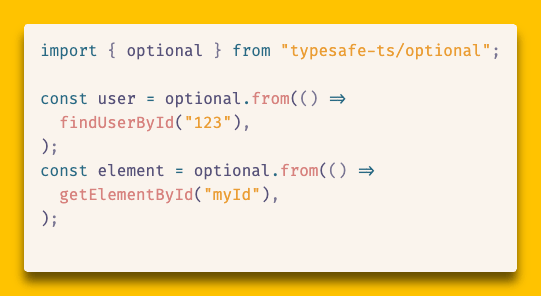

# Optional

The `Optional` type is a monadic alternative to `null`/`undefined` for expressing the result of operations that may not produce a value, and to work with those results. It provides a way to handle optional values in an expressive and type-safe manner.

Code that returns `null` or `undefined` when it doesn't produce a value has a couple shortcomings:

1. It can't distinguish between "no value" and "value is `null`/`undefined`".
2. Client code must check for `null`/`undefined` before using the value, which can lead to repetitive and error-prone code.

`Optional` addresses these issues by wrapping a value that may or may not be present in a way that allows `null`/`undefined` to be valid values. It additionally provides expressive methods that encapsulate the checks for empty values, making it possible to write expressive code that doesn't need to repeatedly check for an empty value.

# The `Optional` interface

`Optional` is fully documented inline. The best way to view its documentation is in your editor, while using it. You can also view the documentation for each method [in this source code](./optional.ts).

Here's an overview of the `Optional` interface:

```ts optional.ts
// Interface definition that can be used for type annotations.
export interface Optional<ValueType> {
  // Check if the optional has a value. If it does, it will be widened to include a `value` property.
  is_some(): this is OptionalWithValue<ValueType>;

  // If the optional has a value, return it. Otherwise, return the provided default value.
  value_or(value_if_empty: ValueType): ValueType;

  // If the optional has a value, map it and return a new Optional with the mapped value.
  // Otherwise, return an empty Optional.
  map<NewValueType>(
    mapper_fn: (value: ValueType) => NewValueType,
  ): Optional<NewValueType>;

  // If this Optional has a value, apply the function to it. Otherwise, return an empty Optional.
  and_then<NewValueType>(
    fn: (value: ValueType) => Optional<NewValueType>,
  ): Optional<NewValueType>;

  // Provide an alternative value if this Optional is empty.
  or_else(fn: () => Optional<ValueType>): Optional<ValueType>;

  // Iterator support - yields the value if present, nothing if empty.
  [Symbol.iterator](): Generator<ValueType, void, unknown>;
}

export const optional = {
  some, // constructs an `Optional` with a value
  none, // constructs an `Optional` without a value
  from_nullable, // creates an Optional from a nullable value
  from, // (deprecated) executes a function and wraps result
};
```

# Example usage

Sometimes an operation involves a series of steps, any of which may fail to produce a value usable on the next step. This sort of operation often results in repetitive `null` checks that are tedious to write and challenging to read. It requires more code, which increases the likelihood of bugs being introduced and increases the maintenance burden.

Here's an example of such an operation where any of a series of steps may not produce a value. It could benefit from `Optional`'s monadic interface to simplify handling the absence of values.

```ts
function getUserByUsername(username: string): User | null { ... }
function getUserPosts(userId: string): Post[] | null { ... }
function getPostComments(postId: string): Comment[] | null { ... }
function getUserPostsWithComments(
  username: string): { post: Post; comments: Comment[] }[] | null {
  const user: User | null = getUserByUsername(username);
  if (!user) {
    return null;
  }
  const posts: Post[] | null = getUserPosts(user.id);
  if (!posts) {
    return null;
  }
  const postsWithComments = posts.map(post => {
    const comments: Comment[] | null = getPostComments(post.id);
    return {
      post,
      comments: comments
    };
  });
  return postsWithComments.filter(
    ({ comments }) => comments !== null && comments.length > 0
  );
}

const postsWithComments = getUserPostsWithComments('alice');
if(postsWithComments) {
    renderPostsWithComments(postsWithComments);
} else {
    renderEmptyPosts();
}
```

At every step, the code needs to perform a `null` check. Out of 18 lines of code, 8 of them are null checks. Every function called by `getUserPostsWithComments` must have its own null checks, and the client code consuming `getUserPostsWithComments` must also check for `null`. That's a lot of boilerplate code to do nothing!

Let's take a look at how this code could be implemented using `Optional` instead of `null` to represent the absence of a value. Optional provides interfaces for operating on the value if it is present or if it is empty. This makes it straightforward to chain operations and handle the absence of values.

```ts
function getUserByUsername(username: string): Optional<User> { ... }
function getUserPosts(userId: string): Optional<Post[]> { ... }
function getPostComments(postId: string): Optional<Comment[]> { ... }
function getUserPostsWithComments(
  username: string): Optional<{ post: Post; comments: Comment[] }[]> {
  getUserByUsername(username)
    .and_then(user => getUserPosts(user.id))
    .and_then(posts => posts.map(post => ({
      post,
      comments: getPostComments(post.id)
    })))
    .and_then(postsWithComments => postsWithComments.filter(
      ({ comments }) => comments.has_value() && comments.length > 0
    ));
}

const postsWithComments = getUserPostsWithComments(`alice`);
if(postsWithComments.is_some()) {
    // the `.value` property is only available after widening it by checking `is_some()`
    renderPostsWithComments(postsWithComments.value);
} else {
    renderEmptyPosts();
}
```

Similar to the version using `null`, each step of the operation will only be run if the previous step produced a value. `Optional`'s `.and_then()` method encapsulates the empty check and only runs the provided function is a value is present. This made it possible to implement the `getUserPostsWithComments` using `Optional` in 11 lines of code, whereas before it required 20 lines.

# Static Enforcement

To help teams consistently adopt `Optional` patterns and avoid mixing nullable types with `Optional`, this utility includes an ESLint rule that enforces proper usage patterns. The rule helps identify places where nullable types (`T | null | undefined`) should be replaced with `Optional<T>` and suggests using `optional.from_nullable()` when calling functions that return nullable values.

## Installation and Setup

The ESLint rule is included with the Optional utility. To use it in your project with ESLint flat config:

```js eslint.config.js
import { enforceOptionalUsage } from './src/optional/eslint-rule.ts';

export default [
  {
    files: ['**/*.ts', '**/*.tsx'],
    plugins: {
      'optional': {
        rules: {
          'enforce-optional-usage': enforceOptionalUsage
        }
      }
    },
    rules: {
      'optional/enforce-optional-usage': 'error'
    }
  }
];
```

## Configuration Options

The rule accepts two configuration options:

### `allowExceptions` (string[])

An array of function names or patterns to exclude from the rule. Supports wildcard patterns using `*`.

```js eslint.config.js
rules: {
  'optional/enforce-optional-usage': ['error', {
    allowExceptions: [
      'legacyFunction',      // Exact match
      'legacy*',             // Wildcard pattern
      '*Callback',           // Functions ending with 'Callback'
      'third-party-*'        // Third-party function patterns
    ]
  }]
}
```

### `autoFix` (boolean, default: true)

Controls whether the rule provides automatic fixes for violations.

```js eslint.config.js
rules: {
  'optional/enforce-optional-usage': ['error', {
    autoFix: false  // Disable automatic fixes
  }]
}
```

## Rule Violations and Fixes

The rule identifies three types of violations and provides automatic fixes where possible:

### 1. Nullable Return Types (`noNullableReturn`)

**Violation:** Functions returning `T | null` or `T | undefined`

```ts
// ❌ ESLint Error: Functions should return Optional<User> instead of User | null | undefined
function findUser(id: string): User | null {
  return users.find(u => u.id === id) ?? null;
}

// ✅ Fixed: Use Optional<T> return type
function findUser(id: string): Optional<User> {
  const user = users.find(u => u.id === id);
  return user ? optional.some(user) : optional.none();
}
```

**Note:** Auto-fix is disabled for this violation because it would only change the return type without updating the return statements. You must manually change both the return type to `: Optional<User>` and update return statements to use `optional.some(value)` or `optional.none()`.

**Disable rule:** `// eslint-disable-next-line typesafe-ts/enforce-optional-usage`

### 2. Nullable Function Calls (`useOptionalFromNullable`)

**Violation:** Direct calls to functions that return nullable types without wrapping in `optional.from_nullable()`

```ts
// ❌ ESLint Error: Function calls and other expressions that evaluate to nullable values should be wrapped in optional.from_nullable()
const element = document.getElementById('my-element');  // returns HTMLElement | null
const user = users.find(u => u.active);                // returns User | undefined

// ✅ Fixed: Wrap with optional.from_nullable()
const element = optional.from_nullable(document.getElementById('my-element'));
const user = optional.from_nullable(users.find(u => u.active));
```

**Auto-fix:** Function calls are automatically wrapped with `optional.from_nullable(originalCall())`.

**Important:** After applying the auto-fix, you'll need to update your code to use the Optional API methods like `is_some()`, `value_or()`, `map()`, etc. instead of directly accessing the potentially null/undefined value.

**Disable rule:** `// eslint-disable-next-line typesafe-ts/enforce-optional-usage`

**Note:** `optional.from()` is deprecated. Use `optional.from_nullable()` for direct nullable values instead.

The rule recognizes common nullable-returning APIs including:
- DOM methods: `getElementById`, `querySelector`, `getElementsByClassName`, `getElementsByTagName`
- Array methods: `find`, `pop`, `shift`
- String methods: `match`

### 3. Nullable Union Types (`noNullableUnion`)

**Violation:** Variable declarations with nullable union types

```ts
// ❌ ESLint Error: Union types with null/undefined should use Optional<string> instead of string | null | undefined
let userName: string | null = null;
const result: number | undefined = computeValue();

// ✅ Fixed: Use Optional<T> instead
let userName: Optional<string> = optional.none();
const result: Optional<number> = optional.from(() => computeValue());
```

**Note:** Auto-fix is disabled for this violation because it would only change the type annotation without updating the initialization value. You must manually change both the type to `: Optional<T>` and initialize with `optional.some(value)` or `optional.none()`.

**Disable rule:** `// eslint-disable-next-line typesafe-ts/enforce-optional-usage`

## Message Types

The rule provides specific error messages for each violation type:

- **`noNullableReturn`**: "Functions should return Optional<T> instead of T | null | undefined. Change the return type and update return statements to use optional.some(value) or optional.none()."
- **`useOptionalFromNullable`**: "Function calls and other expressions that evaluate to nullable values should be wrapped in optional.from_nullable()."
- **`noNullableUnion`**: "Union types with null/undefined should use Optional<T> instead of T | null | undefined. Change the type annotation and initialize with optional.some(value) or optional.none()."

## Exception Handling

Use the `allowExceptions` option for cases where nullable types are necessary, such as:

```js eslint.config.js
rules: {
  'optional/enforce-optional-usage': ['error', {
    allowExceptions: [
      'React*',              // React component props/callbacks
      '*Callback',           // Callback functions
      'legacy*',             // Legacy API functions
      'thirdPartyApiCall'    // Specific third-party functions
    ]
  }]
}
```

This allows you to gradually adopt `Optional` patterns while maintaining compatibility with existing code and third-party libraries that expect nullable types.

# Migration Guide

## `optional.from()` Deprecation

The `optional.from()` method is deprecated in favor of `optional.from_nullable()` for better API ergonomics. The current `from()` method requires wrapping function calls in lambdas, while `from_nullable()` accepts nullable values directly.

<picture>
  <source media="(prefers-color-scheme: dark)" srcset="../../assets/images/deprecate-optional-from-dark.gif">
  <source media="(prefers-color-scheme: light)" srcset="../../assets/images/deprecate-optional-from-light.gif">
   findUserById('123')) and optional.from(() => document.getElementById('myId')) to optional.from_nullable(findUserById('123')) and optional.from_nullable(document.getElementById('myId'))">
</picture>

### Future Breaking Change

In the next major release, `optional.from()` will be renamed to accept nullable values directly, matching the current behavior of `from_nullable()`:

```typescript
// Future behavior (next major version)
const user = optional.from(findUserById("123"));
const element = optional.from(document.getElementById("myId"));
```

To prepare for this change:
1. Replace all `optional.from(() => expr)` with `optional.from_nullable(expr)` 
2. Update your ESLint rule to automatically suggest `from_nullable()` for nullable expressions
